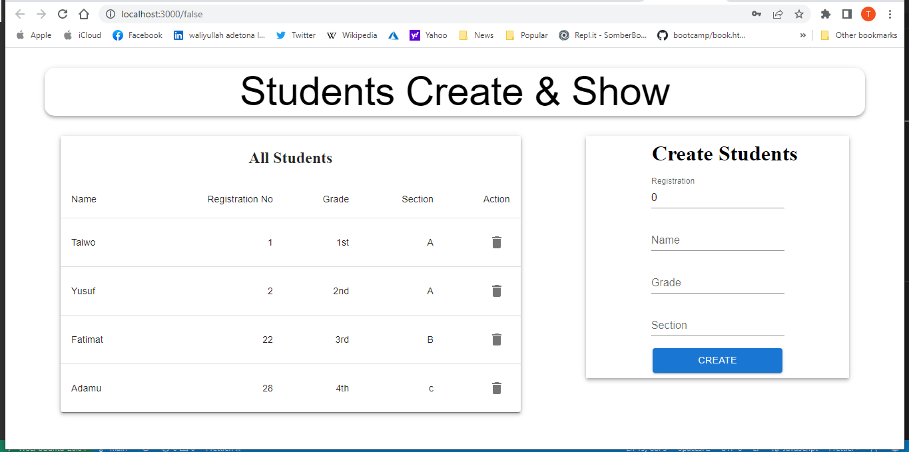

# A Full-Stack(MERN) school-mangement-system

This project is based on school Management system. It is an app to make a Crud operation by the Administrator, where he /she can Add/Delete  student details. The Client folder contains the Frontend while the server folder contains the Backend using nodejs.

* 

## Built With
* HTML and JSX
* React
* CSS
* ES6
* nodejs
* mongodb
* material ui

## Getting Started:

To get a local copy up and running follow these simple example steps:

1. Under the repository name, click the Clone or download green button.

2. Copy the URL given by clicking the clipboard button.

3. Open a terminal window in your local machine and change the current directory to the one you
   want the clone directory to be made.

4. Type  git clone and then paste the URL you previously copied to the clipboard.

5. Open a new terminal window in your local machine and change the current directory to your
   cloned directory.

6. Run `npm install` / `npm i` from the Terminal.

7. Finally `npm start`.

## Testing :

$ npm test

## See a live demo [Here]()

## Show your support
Give a ⭐️ if you like this project!

## Authors

👤 Taiwo Adetona

- Github: [@taiwo2](https://github.com/taiwo2)

- LinkedIn: [Taiwo Adetona](https://www.linkedin.com/in/taiwo-adetona/)

- Twitter: [@TaiwoAdetona4](https://twitter.com/TaiwoAdetona4/)

## 🤝 Contributing

Contributions, issues and feature requests are welcome!

Feel free to check the [issues page](../../issues/).